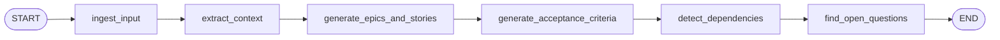

# Requirements Graph

This workflow is currently wired as a simple linear LangGraph pipeline.

State keys carried through the graph:

- `raw_text`
- `normalized_text`
- `sections`
- `extracted_context`
- `epics`
- `open_questions`
- `assumptions`
- `summary`
